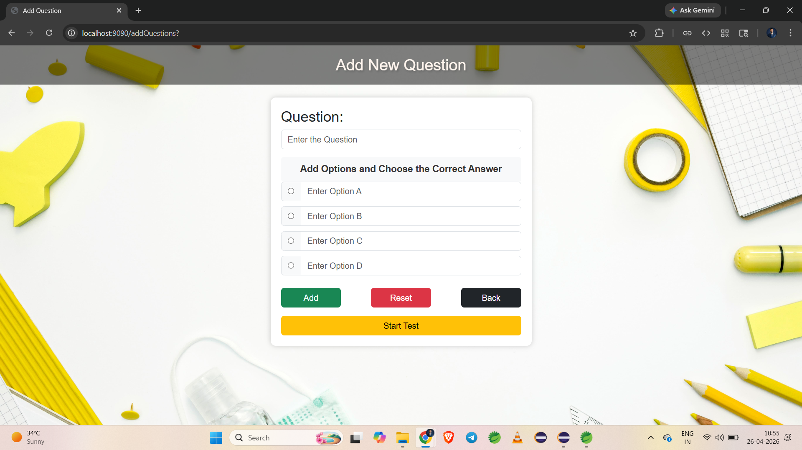
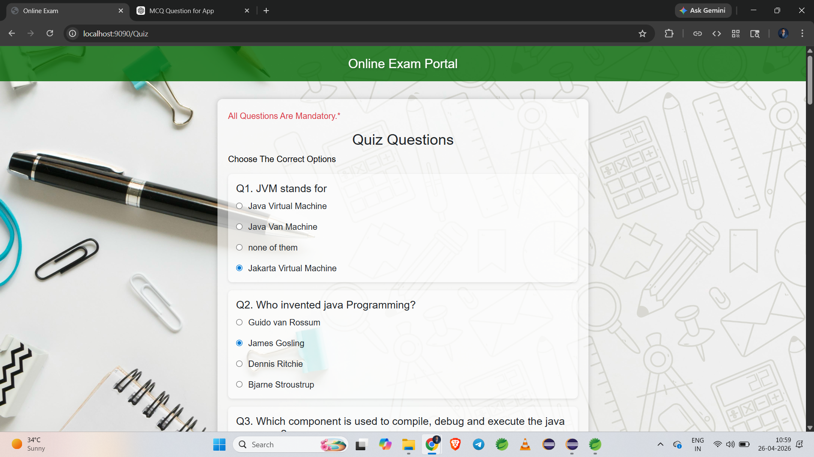

# 🧠 Online Quiz Application

A web-based **Online Quiz Application** built using **Java Spring Boot, Spring MVC, Thymeleaf, and Oracle DB**.
This application allows users to add questions, attempt quizzes, and view their scores instantly.

---

## 🚀 Features

* Add new quiz questions dynamically
* Multiple-choice questions (MCQs)
* Attempt quiz with multiple questions
* Automatic score calculation
* Clean UI using Thymeleaf
* MVC architecture (Controller → Service → Repository)
* Uses GET and POST mappings

---

## 🛠️ Tech Stack

* **Backend:** Java, Spring Boot, Spring MVC
* **Frontend:** Thymeleaf
* **Database:** Oracle DB
* **ORM:** Spring Data JPA / Hibernate
* **Build Tool:** Maven

---

## 📂 Project Structure

```
controller/
service/
repository/
entity/
templates/
```

---

## 🔗 Application Flow

1. Home Page → Start Quiz or Add Question
2. Add Question → Store in Database
3. Start Quiz → Fetch Questions from DB
4. Submit Quiz → Calculate Score
5. Display Result

---
## 📸 Screenshots

### 🏠 Home Page


### ➕ Add Question Page


### 📝 Quiz Page


### 📊 Result Page


### 📊 Result Page

* Shows final score after submission

---

## ▶️ How to Run

1. Clone the repository:

```
git clone https://github.com/Vikasgabale9/QuizApp.git
```

2. Open in **STS / IntelliJ**

3. Configure Oracle DB in `application.properties`

4. Run the Spring Boot application

5. Open in browser:

```
http://localhost:9090
```

---

## 🚀 Future Improvements

* Add **JWT Authentication** for secure login
* Build modern UI using **React or Angular**
* Implement **Leaderboard System**
* Add timer-based quiz functionality
* Send **Quiz Results via Email** using JavaMailSender

---

## 👨‍💻 Author

**Vikas Gabale**

---

## ⭐ Project Highlight

This project demonstrates strong understanding of:

* Spring Boot MVC architecture
* Backend development with Java
* Database integration (Oracle DB)
* Form handling using Thymeleaf
* Real-world application flow

---
